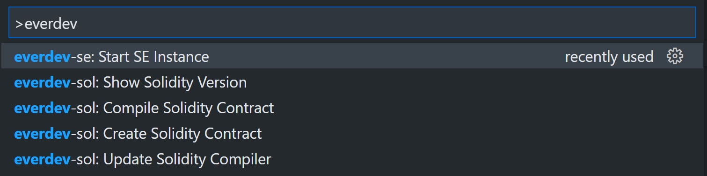
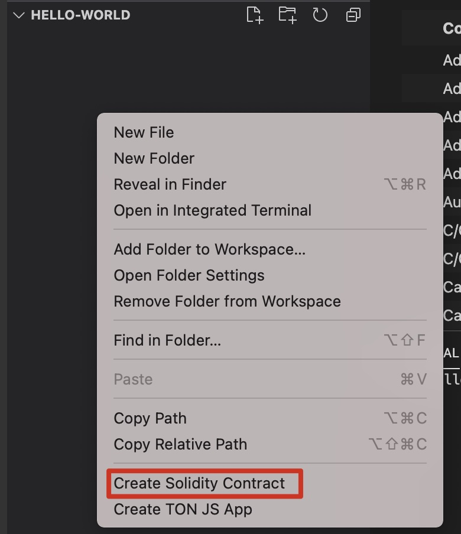
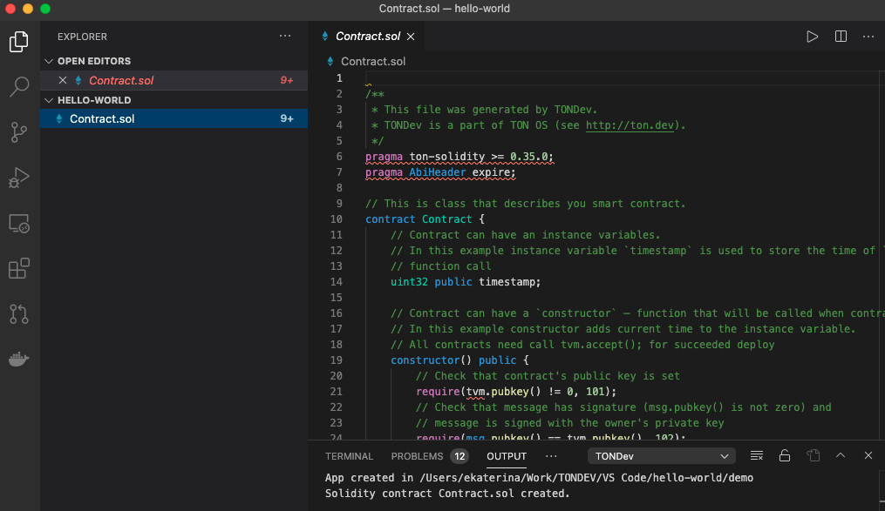
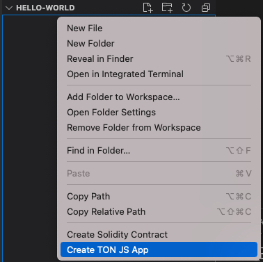
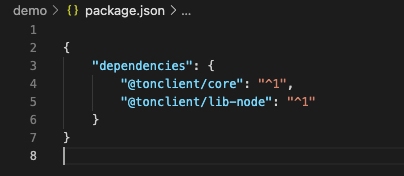

# TONDEV Visual Studio Code plugin

Access [TONDEV](https://docs.ton.dev/) Toolkit functionality directly from popular IDE

# Content Table
- [Installation](#installation)
- [Supported operations](#supported-operations)
  - [Solidity](#solidity)
    - [Hello World](#hello-world)
    - [Compile](#compile)
    - [Version](#version)
    - [Update](#update)
  - [SDK](#sdk)
    - [Create Demo Project](#create-demo-project)
- [Roadmap](#roadmap)
  - [Solidity](#solidity)
  - [C/C++](#cc)
  - [TS4](#ts4)
  - [Network Support](#network-support)

# Installation
Search for [`TONDev` extention](https://marketplace.visualstudio.com/items?itemName=TONLabs.tondev) in VS Code Marketplace and install it.

# Supported operations:

## Solidity
### Hello World
Click on the empty space in Explorer and find `Create Solidity Contract` command or access it from 
`View->Command palette->TONDEV: Create Solidity Contract`.

.

We named the contract `Contract`. After command is finished you will see the source code of hello world contract that you can now compile.

.

### Compile
Find `Compile Solidity Contract` command in the .sol file context menu or access it from 
`View->Command palette->TONDEV: Compile Solidity Contract`

### Version
Access this command from 
`View->Command palette->TONDEV: Show Solidity Version`

### Update
In case you had some problems with installation or want to pull the latest compiler version use this command.
Access it from `View->Command palette->TONDEV: Update Solidity Compiler`

## SDK
### Create Demo Project 
Click on the empty space in Explorer and find `Create TON JS App` command or access it from 
`View->Command palette->TONDEV: Create TON JS App`. 

We named our project `demo`. After command is finished you will see package.json with js sdk dependencies 
and index.js file with client creation, connecting to local blockchain [TONOS Startup Edition](https://docs.ton.dev/86757ecb2/p/19d886-ton-os-se). 

To connect to the local blockchain you need to run it. [Find out how to launch it here](https://docs.ton.dev/86757ecb2/p/324b55-installation/t/7337a3).  

Client creation:

Dependencies:

# Roadmap:

## Solidity
- support other compilation and linking options

## C/C++
- Compile C/C++ contracts

## TS4
- debug contracts with TS framework and tools

## Network support
- connection to main.ton.dev, net.ton.dev and custom network configurations
- local network
- deploying to networks
- operating with TON blockchains including real blockchain networks, TONOS SE

