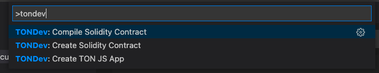

# TONDEV Visual Studio Code plugin

Access [TONDEV](https://docs.ton.dev/) Toolkit functionality directly from popular IDE
# Currently supports:

## Solidity
### Hello World
Click on the empty space in Explorer and find `Create Solidity Contract` command or access it from 
`View->Command palette->TONDEV: Create Solidity Contract`. 

### Compile
Find `Compile Solidity Contract' command in the .sol file context menu or access it from 
`View->Command palette->TONDEV: Compile Solidity Contract`

## SDK
### demo nodejs project 
Click on the empty space in Explorer and find `Create TON JS App` command or access it from 
`View->Command palette->TONDEV: Create TON JS App`. 

# Roadmap:

## Solidity
- support other compilation and linking options

## C/C++ contracts
- Compile C/C++ contracts

## TS4
- debug contracts with TS framework and tools

## Network support
- connection to main.ton.dev, net.ton.dev and custom network configurations
- local network
- deploying to networks
- operating with TON blockchains including real blockchain networks, TONOS SE

